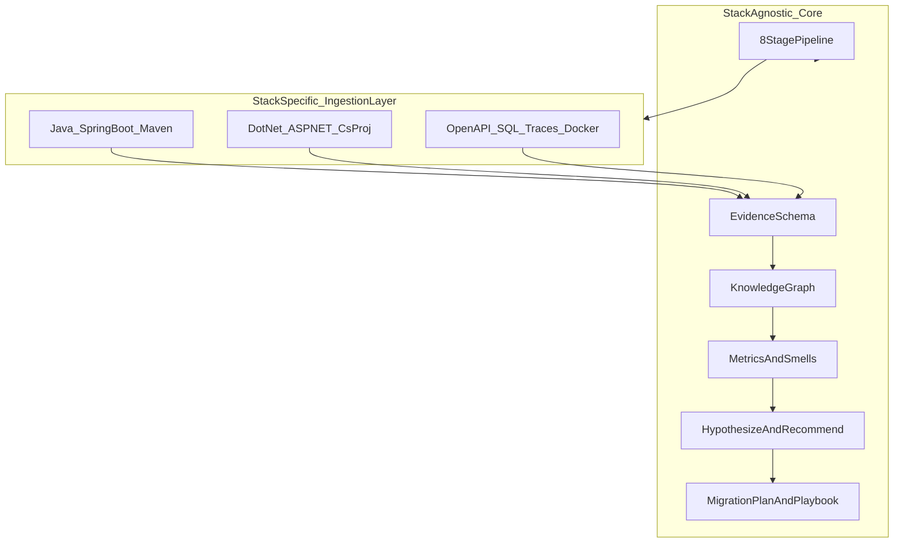
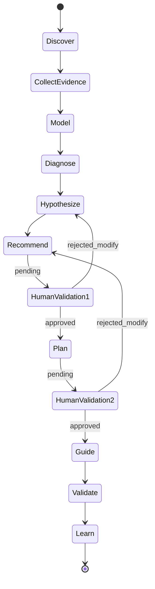
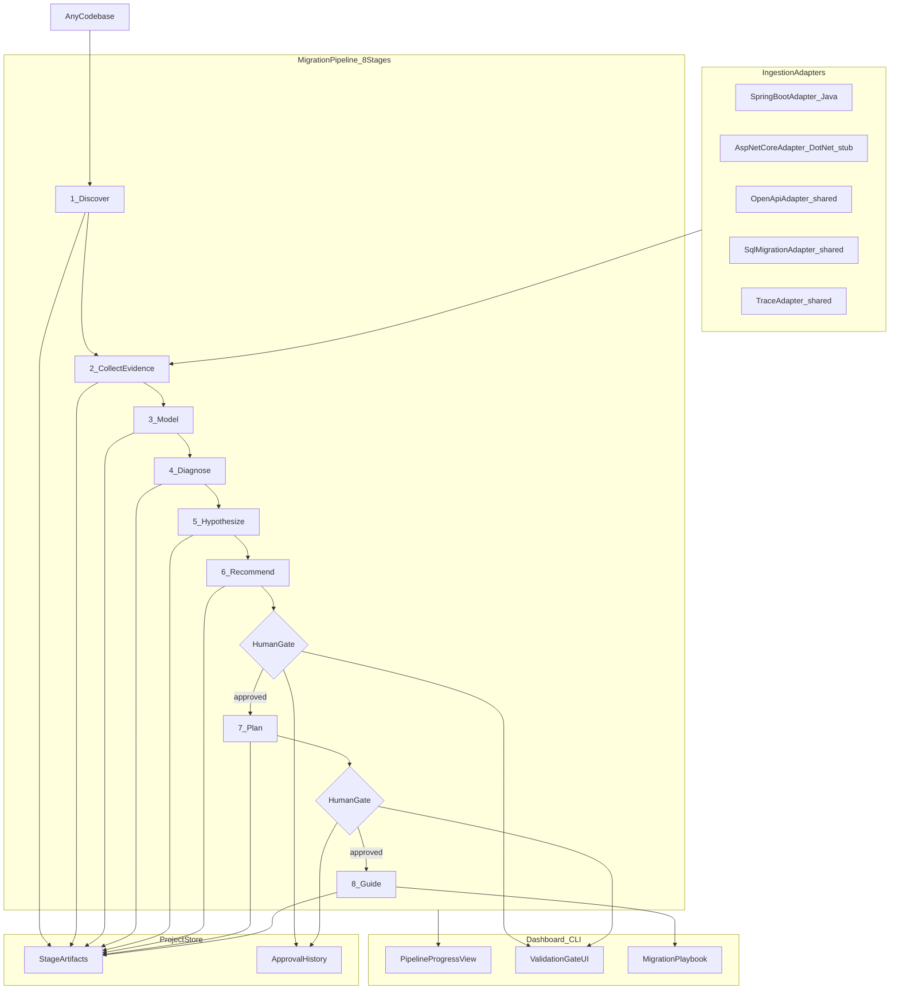
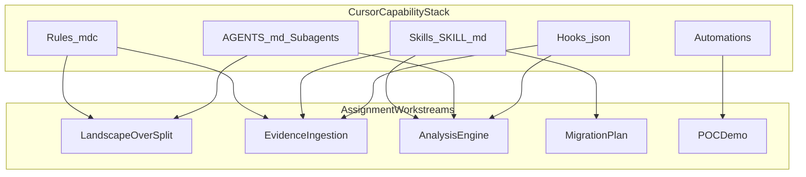
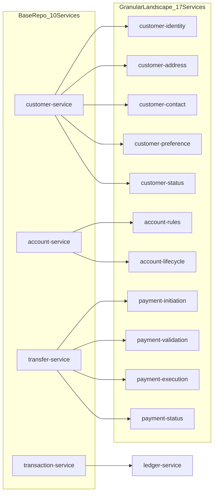

# AI-Driven Granular-to-Bounded-Context Migration POC

## Current State

The repo ([README.md](README.md)) is an empty scaffold. All components must be built from scratch. Your R&D correctly identifies the core thesis:

> **Technology-oriented decomposition → business-capability-oriented decomposition**

The POC must prove one thing convincingly:

> Can AI discover better business boundaries from badly decomposed microservices, explain why, and produce an actionable migration path?

It must also prove the framework is **reusable and technology-agnostic**: a developer pointing the tool at a new granular microservice codebase — Java, .NET, or other — follows the same gated pipeline. Only the **ingestion adapters** change per stack; the pipeline, graph model, metrics, and AI stages remain identical.

---

## Technology-Agnostic Architecture

The framework separates **what is universal** from **what is stack-specific**.



### What stays the same (any technology)

| Layer | Components | Notes |
|-------|------------|-------|
| Pipeline | 8 stages, gates, CLI, dashboard | Unchanged |
| Evidence schema | Normalized `EvidenceItem` types | Stack-neutral vocabulary |
| Knowledge graph | Nodes: Service, API, Table, Event… | No `@Entity` or `DbContext` in graph |
| Diagnose | Coupling, cohesion, smells | Operates on graph only |
| AI stages | Hypothesize, Recommend, Plan narrative | Receives graph + metrics, not raw source |
| Migration playbook | Phase tasks, compatibility layers | Wording adapts to stack in Stage 8 |

### What changes per technology (adapters only)

| Stack | Discover signals | Stack-specific adapters | Shared adapters |
|-------|------------------|-------------------------|-----------------|
| **Java / Spring Boot** (POC) | `pom.xml`, `build.gradle`, `@SpringBootApplication` | `SpringBootAdapter`, `MavenAdapter` | OpenAPI, SQL, Trace, Metadata, Docker |
| **.NET / ASP.NET Core** (future) | `*.csproj`, `*.sln`, `Program.cs` | `AspNetCoreAdapter`, `CsProjAdapter`, `EfCoreAdapter` | OpenAPI, SQL, Trace, Metadata, Docker |
| **Node / NestJS** (future) | `package.json`, Nest modules | `NestJsAdapter`, `NpmAdapter` | OpenAPI, SQL, Trace, Metadata, Docker |

Adding .NET support later = implement 3 new adapters + register them. **No pipeline or graph changes.**

### Stack detection (Stage 1 — Discover)

Discover scans for stack markers and produces a `TechStackProfile`:

```json
{
  "primary_stack": "java-spring-boot",
  "signals": ["pom.xml", "spring-boot-starter-web"],
  "secondary_stacks": [],
  "recommended_adapters": ["SpringBootAdapter", "MavenAdapter", "OpenApiAdapter", "SqlMigrationAdapter"]
}
```

| Marker files | Detected stack |
|--------------|----------------|
| `pom.xml` / `build.gradle` + `*Application.java` | `java-spring-boot` |
| `*.csproj` / `*.sln` + `Program.cs` / `Startup.cs` | `dotnet-aspnetcore` |
| `package.json` + Nest/Express patterns | `node-nestjs` / `node-express` |
| `docker-compose.yml`, `openapi.yaml` | Stack-agnostic (always scanned) |

If multiple stacks detected (polyglot estate), run adapters for each and merge into one graph.

### Technology-neutral evidence schema

All adapters emit the same `EvidenceItem` shape — defined in [metadata/evidence-schema.json](metadata/evidence-schema.json):

```json
{
  "type": "http_endpoint",
  "source_adapter": "SpringBootAdapter",
  "service": "customer-identity-service",
  "properties": {
    "path": "/api/customers/{id}",
    "method": "GET",
    "request_schema": "CustomerResponse"
  }
}
```

A .NET adapter emits identical structure:

```json
{
  "type": "http_endpoint",
  "source_adapter": "AspNetCoreAdapter",
  "service": "CustomerIdentity.Api",
  "properties": {
    "path": "/api/customers/{id}",
    "method": "GET",
    "request_schema": "CustomerResponse"
  }
}
```

The graph builder never branches on `source_adapter` — only on normalized `type`.

### Adapter registry

```python
# platform/ingestion/registry.py
class AdapterRegistry:
    def adapters_for(self, profile: TechStackProfile) -> list[IngestionAdapter]:
        # Always include stack-agnostic adapters
        # Add stack-specific adapters based on profile.primary_stack
```

**POC scope:** Implement and test Java/Spring Boot adapters fully.  
**Stretch / Phase 2:** Implement `.NET` adapters (`AspNetCoreAdapter`, `CsProjAdapter`, `EfCoreAdapter`) with interface stubs and unit tests showing registry selection — proves extensibility without requiring a .NET sample bank for the assignment.

### POC vs framework boundary

| Component | Technology | Role |
|-----------|------------|------|
| `sample-bank/` | Java/Spring Boot only | Reference granular estate for demo |
| `platform/` | Python (framework runtime) | Stack-agnostic; never imports Java/.NET |
| `metadata/evidence-schema.json` | Neutral | Contract all adapters must satisfy |
| `.cursor/rules/java-microservices.mdc` | Java | Applies only when editing `sample-bank/` |
| Future `.cursor/rules/dotnet-microservices.mdc` | .NET | When a .NET sample is added later |

---

## Framework Methodology: The Migration Pipeline

This is the **core operating model** of the platform — not a one-off POC flow. Every new codebase goes through the same gated stages. AI assists at specific stages; humans approve before anything advances.

### What we explicitly reject

```text
❌  Codebase → AI → automatically merge services → done
```

### What we build

```text
✅  Discover → Evidence → Model → Diagnose → Hypothesize → Recommend
    → [Human Validation Gate]
    → Plan → [Human Validation Gate]
    → Guide (developer executes) → Validate → Learn
```

### Recommended 8-stage pipeline

| Stage | Name | Primary actor | Output | Human gate? |
|-------|------|---------------|--------|-------------|
| **1** | **Discover** | Framework (deterministic) | Service inventory, tech stack profile, repo map | Optional: confirm landscape |
| **2** | **Collect Evidence** | Framework + adapters | Static code, APIs, DB schemas, deps, traces, business docs, team data | Optional: upload business context |
| **3** | **Model** | Framework (graph builder) | Architecture Knowledge Graph | No |
| **4** | **Diagnose** | Framework (metrics engine) | Health assessment, smell report, coupling/cohesion scores | Review health report |
| **5** | Hypothesize | AI (LLM) | 2–4 candidate bounded-context groupings with confidence + evidence | No |
| **6** | Recommend | AI (LLM) | Target architecture, ADRs, impact analysis, risks | **Required: approve / reject / modify** |
| **7** | Plan | AI + framework | Phased migration plan, sequencing, compatibility layers | **Required: approve migration plan** |
| **8** | Guide | Framework + developer | Step-by-step migration playbook per phase; developer executes manually | Per-phase sign-off |

Stages 1–4 are **fully deterministic** (no LLM). Stage 5 introduces AI hypotheses. Stages 6–7 require human approval before unlock. Stage 8 is **AI-assisted execution guidance**, not autonomous code transformation.



### Stage details

**Stage 1 — Discover**
- Input: path to any microservice codebase (Java, .NET, polyglot)
- Scan for: stack markers (Maven/Gradle, `.csproj`/`.sln`, `package.json`), Docker services, OpenAPI specs
- Output: `landscape.json` + `tech-stack-profile.json` — service list, ports, databases, **detected stack**, recommended adapters

**Stage 2 — Collect Evidence**
- Run pluggable **Ingestion Adapters** (see below)
- Evidence categories: static (code, APIs, DB, deps), runtime (traces, call frequency), business (capability map, glossary), organizational (team ownership, co-change)
- Output: normalized evidence bundle per `evidence-schema.json`

**Stage 3 — Model**
- Merge all evidence into Architecture Knowledge Graph
- Output: `graph.json` with typed nodes and edges

**Stage 4 — Diagnose**
- Compute metrics: coupling, cohesion, data ownership violations, transaction paths, change coupling
- Flag smells: granularity, false cohesion, distributed monolith patterns
- Output: `health-report.json` — **no LLM involved**

**Stage 5 — Hypothesize**
- LLM receives: graph summary + metrics + smells + evidence excerpts
- Produces: multiple candidate bounded-context clusterings (not a single answer)
- Each hypothesis includes: services grouped, confidence %, supporting evidence, contradicting signals
- Output: `hypotheses.json`

**Stage 6 — Recommend**
- LLM selects/refines best hypothesis into target architecture
- Generates ADRs per bounded context: why together, why not separate, data ownership, APIs, events, risks
- Output: `recommendation.json` + markdown ADRs
- **Gate**: architect must approve, reject, or modify before Stage 7 unlocks

**Stage 7 — Plan**
- Framework generates sequenced migration plan: which services to consolidate first, API compatibility layers, data migration, event changes, rollback strategy
- Output: `migration-plan.json`
- **Gate**: architect must approve plan before Stage 8 unlocks

**Stage 8 — Guide**
- Per-phase playbook: concrete tasks for the developer (not auto-execution)
- Example Phase 1 tasks: "Create compatibility API in customer-identity", "Migrate address table", "Update gateway routes"
- Developer marks tasks complete; framework tracks progress
- Optional: Cursor skill assists developer during manual migration

### Reusability: onboarding a new codebase

After the POC, a developer onboarding a new estate follows:

```bash
# 1. Register new project
migrate-framework init --name "RetailBank" --path /path/to/codebase

# 2. Run pipeline stages (each produces artifacts, gates enforced)
migrate-framework run --stage discover
migrate-framework run --stage evidence
migrate-framework run --stage model
migrate-framework run --stage diagnose
migrate-framework run --stage hypothesize    # uses OpenAI
migrate-framework run --stage recommend      # blocks until human approves
migrate-framework run --stage plan           # blocks until human approves
migrate-framework run --stage guide          # interactive playbook

# 3. Or via dashboard: point at repo, click through pipeline with approval UI
```

Framework stores each project under `platform/projects/{project-id}/` with stage artifacts and approval history.

### Pluggable ingestion adapters

Adapters implement a common interface and emit **technology-neutral** `EvidenceItem` objects. Stack-specific logic stays inside each adapter.

```python
# platform/ingestion/adapters/base.py
class IngestionAdapter(Protocol):
    name: str
    supported_stacks: list[str]          # e.g. ["java-spring-boot"]
    def can_handle(self, profile: TechStackProfile) -> bool: ...
    def ingest(self, root_path: Path) -> list[EvidenceItem]: ...
```

#### Stack-agnostic adapters (any technology)

| Adapter | Handles | Evidence produced |
|---------|---------|---------------------|
| `OpenApiAdapter` | OpenAPI/Swagger YAML/JSON | Endpoints, schemas |
| `SqlMigrationAdapter` | Flyway, Liquibase, EF migrations | Tables, FKs |
| `TraceAdapter` | Jaeger/Zipkin JSON or synthetic traces | Call paths, frequency |
| `MetadataAdapter` | `metadata/` YAML/JSON | Business capabilities, teams, co-change |
| `DockerComposeAdapter` | docker-compose.yml | Service topology, ports |

#### Java / Spring Boot adapters (POC — fully implemented)

| Adapter | Handles | Evidence produced |
|---------|---------|---------------------|
| `SpringBootAdapter` | `@RestController`, `@Entity`, `@KafkaListener` | HTTP endpoints, domain entities, events |
| `MavenAdapter` | Maven multi-module `pom.xml` | Inter-service dependencies |

#### .NET / ASP.NET Core adapters (future — stub in POC)

| Adapter | Handles | Evidence produced |
|---------|---------|---------------------|
| `AspNetCoreAdapter` | Controllers, Minimal APIs, `[ApiController]` | HTTP endpoints |
| `CsProjAdapter` | `*.csproj` project references | Inter-service dependencies |
| `EfCoreAdapter` | `DbContext`, EF migrations | Domain entities, tables, FKs |

POC delivers **interface + registry wiring + empty stub implementations** for .NET adapters with a unit test proving `adapters_for(dotnet-aspnetcore profile)` returns the correct set. Full .NET adapter logic is Phase 2 when a .NET sample estate is available.

```bash
# Same CLI regardless of stack — adapters selected automatically
migrate-framework init --name "DotNetBank" --path /path/to/dotnet-repo
migrate-framework run --stage discover   # detects dotnet-aspnetcore
migrate-framework run --stage evidence   # runs AspNetCore + CsProj + shared adapters
```

### AI vs deterministic boundary (critical design rule)

| Capability | Deterministic | AI (LLM) |
|------------|---------------|----------|
| Service discovery | Yes | No |
| Graph construction | Yes | No |
| Coupling/cohesion metrics | Yes | No |
| Smell detection | Yes | No |
| Domain concept extraction | Partial | Yes (semantic) |
| Bounded context hypotheses | No | Yes |
| ADR narrative + reasoning | No | Yes |
| Migration sequencing logic | Yes (graph algorithms) | Yes (risk narrative) |
| Code merging / refactoring | **Never** | **Never** |

---

## Target POC Architecture



---

## Cursor-Native Development Framework

Use Cursor's full capability stack so every workstream is repeatable, guided, and agent-friendly. This is also a **meta-deliverable** for the assignment: the POC demonstrates AI-driven architecture migration *and* AI-assisted development of that POC.



### 1. Rules (`.cursor/rules/`)

Persistent context loaded automatically when matching files are open.

| Rule file | Scope | Purpose |
|-----------|-------|---------|
| `project-core.mdc` | `alwaysApply: true` | Assignment thesis, 8-stage pipeline, **tech-agnostic core / stack-specific adapters**, evidence-first AI |
| `java-microservices.mdc` | `sample-bank/**/*.java`, `**/pom.xml` | Spring Boot 3 conventions — **only for POC sample bank** |
| `python-platform.mdc` | `platform/**/*.py` | FastAPI/NetworkX conventions; adapters must emit neutral EvidenceItem; no stack logic in pipeline core |
| `ddd-boundaries.mdc` | `platform/analysis/**`, `docs/**` | Bounded context vocabulary, ADR format, confidence + evidence requirements |
| `smell-injection.mdc` | `sample-bank/**` | Intentional anti-patterns checklist (shared DB, sync chains, cross-FKs) — do NOT "fix" these |

Example core principle in `project-core.mdc`:

> Follow the 8-stage Migration Pipeline. Stages 1–4 are deterministic only. Stages 5–7 require evidence-backed AI output. Stages 6–7 require human approval before advancing. Never auto-merge services.

### 2. Skills (`.cursor/skills/`)

Project-scoped skills in `.cursor/skills/` (checked into repo, shared with team). Each skill includes workflow steps and optional utility scripts.

| Skill | Trigger terms | Pipeline stage | What it does |
|-------|---------------|----------------|--------------|
| `run-pipeline-stage/` | "run stage", "discover", "diagnose", "hypothesize" | All | Execute one pipeline stage; enforce gates; write artifacts to `platform/projects/` |
| `over-split-microservice/` | "split service", "over-split", "granular smell" | POC setup only | Fork entity/controller subset, inject smells (sample-bank only) |
| `ingest-architecture-evidence/` | "ingest", "collect evidence" | Stage 2 | Run all enabled adapters for a codebase path |
| `bounded-context-analysis/` | "hypothesize", "recommend", "health assessment" | Stages 4–6 | Diagnose → hypothesize → recommend with evidence package |
| `generate-migration-plan/` | "migration plan", "strangler", "sequencing" | Stage 7 | Phased plan, risk matrix, compatibility checklist |
| `generate-adr/` | "ADR", "architecture decision" | Stage 6 | Structured ADR template with evidence bullets |
| `migration-playbook/` | "guide migration", "playbook", "phase tasks" | Stage 8 | Developer task checklist per migration phase |
| `onboard-new-codebase/` | "new codebase", "init project", "register repo" | Stage 1 | `migrate-framework init` workflow for any new estate |
| `poc-demo-walkthrough/` | "run demo", "demo script" | Demo | Walk through pipeline on sample-bank with approval gates |

Skills use the **Workflow + Feedback Loop** pattern: checklist progress, run validation script, only proceed when checks pass.

### 3. Agents (`AGENTS.md` + subagents)

[AGENTS.md](AGENTS.md) at repo root orchestrates multi-agent workflows — when to use which subagent and in what order.

```markdown
# Agent Orchestration

## Landscape work (sample-bank/)
- Use `explore` subagent to map existing base-repo structure before splitting
- Use `generalPurpose` for mechanical over-split of one service at a time
- Never use agents to "refactor toward clean architecture" — smells are intentional

## Analysis work (platform/)
- Use `explore` (medium) to trace ingestion → graph → analysis data flow
- Use `bounded-context-analysis` skill before any OpenAI call
- Use `bugbot` subagent after significant platform changes (explicit review only)

## Parallel patterns
- Ingestion scanners: launch 2-3 `explore` agents in parallel (Java scanner, OpenAPI parser, metadata loader)
- Documentation: one agent drafts ADR while another updates architecture diagrams
```

Subagent usage map:

| Task | Subagent | Skill |
|------|----------|-------|
| Map base repo before fork | `explore` (medium) | — |
| Split customer-service → 5 services | `generalPurpose` | `over-split-microservice` |
| Build ingestion pipeline | `explore` + implement | `ingest-architecture-evidence` |
| Run full analysis | parent agent | `bounded-context-analysis` |
| Review platform code | `bugbot` | — |

### 4. Hooks (`.cursor/hooks.json`)

Project hooks automate quality gates around agent edits.

| Event | Hook | Behavior |
|-------|------|----------|
| `afterFileEdit` | `.cursor/hooks/validate-java-service.sh` | Matcher: `sample-bank/**` — verify module has `openapi.yaml`, `application.yml` |
| `afterFileEdit` | `.cursor/hooks/validate-python.sh` | Matcher: `platform/**` — run `ruff check` on edited file |
| `postToolUse` | `.cursor/hooks/refresh-graph-hint.sh` | Matcher: `Write` on `sample-bank/**` — inject context: "Re-run ingestion if service topology changed" |
| `beforeShellExecution` | `.cursor/hooks/guard-openai-key.sh` | Matcher: `OPENAI` — warn if `.env` missing or key not set |
| `subagentStop` | `.cursor/hooks/analysis-chain.sh` | When explore subagent finishes landscape mapping, suggest next skill (`over-split-microservice`) |
| `sessionStart` | `.cursor/hooks/session-context.sh` | Inject project phase + link to current todo from plan |

### 5. Workflows (multi-step, repeatable)

Documented workflows combine skills + agents + hooks. Stored in [docs/workflows/](docs/workflows/).

| Workflow | Pipeline stages | Cursor tooling |
|----------|-----------------|----------------|
| **W0: Onboard new codebase** | 1 Discover → 2 Evidence | Skill `onboard-new-codebase`, adapters auto-detect stack |
| **W1: Over-split a service** | POC setup only | Skill `over-split-microservice`, rule `smell-injection` |
| **W2: Full pipeline run** | 1→2→3→4→5→6→[gate]→7→[gate]→8 | Skills chain: `run-pipeline-stage` per stage |
| **W3: Demo preparation** | Run W2 on sample-bank, walk approval gates | Skill `poc-demo-walkthrough` |
| **W4: Add synthetic evidence** | Stage 2 supplement | Skill `ingest-architecture-evidence`, `validate_metadata.py` |

### 6. Cursor Automations (optional, post-POC)

Use the **automate** skill to create scheduled/triggered agents once the repo is on GitHub:

| Automation | Trigger | Action |
|------------|---------|--------|
| Architecture re-analysis | Git push to `sample-bank/**` | Agent runs ingestion + metrics, posts summary as PR comment |
| Weekly health check | Cron (weekly) | Agent validates graph integrity, flags drift from expected 17-service topology |
| Demo readiness | Manual / webhook | Agent runs `poc-demo-walkthrough` checklist, reports blockers |

Automations require the Agents Window and connected GitHub — set up after initial POC scaffold exists.

### Cursor setup sequence (do first)

Before building sample-bank or platform code:

1. Create `.cursor/rules/` (5 rule files)
2. Create `.cursor/skills/` (6 skills with scripts)
3. Create `AGENTS.md` orchestration doc
4. Create `.cursor/hooks.json` + hook scripts
5. Create `docs/workflows/` with W1–W4 markdown guides

This ensures every subsequent implementation session inherits correct context automatically.

---

## Repository Structure

```
AI_Driven_Project_Migration/
├── .cursor/
│   ├── rules/                      # 5 .mdc rule files
│   ├── skills/                     # 6 project skills with scripts/
│   ├── hooks.json                  # Quality gates + workflow chaining
│   └── hooks/                      # Shell scripts for hook events
├── AGENTS.md                       # Multi-agent orchestration guide
├── sample-bank/                    # Java/Spring Boot granular microservices
│   ├── docker-compose.yml          # Postgres, Kafka, all services
│   ├── services/                   # 15-18 intentionally granular services
│   └── shared/                     # Common DTOs, events (intentional coupling)
├── platform/                       # Python AI-assisted migration framework
│   ├── pipeline/                   # 8-stage state machine, gates, CLI
│   ├── projects/                   # Per-codebase artifacts (gitignored or sample only)
│   ├── ingestion/
│   │   ├── registry.py             # Stack detection + adapter selection
│   │   └── adapters/
│   │       ├── base.py             # IngestionAdapter protocol
│   │       ├── shared/             # OpenAPI, SQL, Trace, Docker, Metadata
│   │       ├── java/               # SpringBoot, Maven (POC — full)
│   │       └── dotnet/             # AspNetCore, CsProj, EfCore (stub)
│   ├── graph/                      # Knowledge graph model + persistence
│   ├── analysis/                   # Stage 4 diagnose + Stage 5-6 AI reasoning
│   ├── migration/                  # Stage 7 plan + Stage 8 playbook generator
│   ├── api/                        # FastAPI: /projects, /pipeline/{stage}, /approve
│   └── ui/                         # Streamlit: pipeline progress + approval gates
├── metadata/                       # Evidence for sample-bank (also adapter input format reference)
│   ├── evidence-schema.json        # Normalized evidence contract for any codebase
│   ├── traces/
│   ├── change-coupling/
│   └── business-capabilities/
├── docs/
│   ├── problem-statement.md
│   ├── framework-methodology.md    # 8-stage pipeline reference for developers
│   ├── current-state-architecture.md
│   ├── target-architecture.md
│   ├── workflows/                  # W0–W4 guides
│   └── poc-demo-script.md
└── docker-compose.yml              # Orchestrates everything
```

**Why two stacks in the repo:** Java/Spring Boot for the banking POC sample; Python for the **technology-agnostic** framework runtime. The framework never depends on Java — it only reads Java via adapters. Same for future .NET.

---

## Codebase Source Strategy

**There is no off-the-shelf repo with intentionally bad granular decomposition.** Open-source banking demos (Virtual-Bank-System, Eventuate Tram examples, WSO2 demos) are typically **well-designed** — database-per-service, saga patterns, proper boundaries. That is the opposite of what this assignment needs.

**Chosen approach: Start from an existing demo and artificially over-split it.**

### Base repository

**[noorkang3242-tech/banking-system-microservices](https://github.com/noorkang3242-tech/banking-system-microservices)**

| Attribute | Value |
|-----------|-------|
| Stack | Java 17, Spring Boot 3.3.4, Spring Cloud, MySQL 8, Eureka, API Gateway, JWT |
| Services | 10 (auth, customer, account, transaction, transfer, loan, card, notification + infra) |
| Quality | Production-style, **well-bounded** — ideal as a "before we broke it" baseline |
| License | Check before use; fork into `sample-bank/` with attribution in README |

### Transformation: 10 well-bounded → 15-18 granular services



### Smells to inject (deliberate anti-patterns)

| Smell | How we inject it |
|-------|------------------|
| **Shared database** | Split services read/write overlapping tables in a shared `customer_db` instead of isolated schemas |
| **Synchronous chains** | Replace event-driven flows with sync REST calls (e.g., transfer → account → transaction → notification) |
| **Cross-service FKs** | `customer_address.customer_id` FK to table owned by another service |
| **Granularity smell** | 5 services where 1 `customer-service` existed; 4 where 1 `transfer-service` existed |
| **False cohesion** | Keep `loan-service` and `card-service` naming "customer-*" in APIs but separate domain logic |
| **Distributed transaction paths** | Payment flow spans 6+ sync hops (visible in synthetic traces) |

### What we keep from the base repo

- Spring Boot project structure, Maven multi-module layout
- JWT auth, API Gateway, Eureka (realistic enterprise stack)
- Existing REST endpoints and JPA entities (split across new services)
- Docker/MySQL setup as starting point

### What we add

- South Africa footprint: ZAR currency, FICA references in compliance, regional address validation
- European bank branding in docs and config (rename to hypothetical "EuroSA Bank")
- Kafka for some flows (base uses sync; we add events selectively for realism)
- `metadata/` synthetic traces reflecting the **new** granular topology

### Alternative considered (not chosen)

| Option | Why not |
|--------|---------|
| Author from scratch | More control but slower; base repo gives working auth, gateway, DB setup |
| Metadata-only | No runnable demo; weaker assignment proof |
| Hybrid stubs | User chose full split approach over stubs |

---

## Phase 1: Hypothetical Bank Landscape (Java)

Transform the base repo into **15-18 granular microservices** across 4 banking domains, with deliberate architectural smells baked in.

### Domain: Customer (5 services — high cohesion smell)

| Service | Responsibility | Smell |
|---------|---------------|-------|
| `customer-identity-service` | Name, ID, KYC status | Shares `customers` DB tables |
| `customer-address-service` | Addresses | FK to customer, sync REST calls |
| `customer-contact-service` | Phone, email | Same pattern |
| `customer-preference-service` | Marketing/comm prefs | False cohesion with identity |
| `customer-status-service` | Active/suspended/closed | Lifecycle split across services |

### Domain: Account (3 services)

| Service | Responsibility |
|---------|---------------|
| `account-service` | Account CRUD |
| `account-rules-service` | Overdraft, limits |
| `account-lifecycle-service` | Open, close, freeze |

### Domain: Payments (4 services)

| Service | Responsibility |
|---------|---------------|
| `payment-initiation-service` | Start payment |
| `payment-validation-service` | Rules, limits |
| `payment-execution-service` | Execute transfer |
| `payment-status-service` | Track state |

### Domain: Supporting (4-6 services)

| Service | Responsibility | Smell |
|---------|---------------|-------|
| `ledger-service` | Double-entry bookkeeping | Called synchronously by payment |
| `risk-assessment-service` | Credit/fraud scoring | **False cohesion** — "customer" in API but different context |
| `compliance-service` | AML/regulatory checks | |
| `notification-service` | SMS/email alerts | Event fan-out hub |

Each split service inherits from the base repo's code (controllers, entities, repos) and adds:
- Renamed Spring Boot module with subset of original endpoints
- `application.yml` pointing to shared or overlapping DB schemas (intentional smell)
- OpenAPI spec derived from split controllers
- Maven `pom.xml` with new inter-service sync dependencies
- Kafka producer/consumer only where base repo already had async patterns

**South Africa footprint:** Include ZAR currency handling, FICA compliance references in `compliance-service`, and region-specific address validation in `customer-address-service` — adds realism without expanding scope.

**Attribution:** Document in `sample-bank/README.md` that the landscape was derived from the base repo and intentionally degraded for the assignment.

---

## Phase 2: Synthetic Evidence Layer

Since a full observability stack is out of POC scope, provide **curated synthetic evidence** in [metadata/](metadata/):

- **Distributed traces** (JSON): Payment flow spanning 6+ services synchronously
- **Change coupling matrix**: Which services co-change in releases (e.g., all 5 customer services = 0.87 co-change rate)
- **API call frequency**: Which sync calls dominate
- **Business capability catalogue**: Expected bounded contexts (ground truth for validation)
- **Team ownership map**: All customer services owned by one team

This lets the AI reason over behavioral + organizational signals, not just static code.

---

## Phase 3–8: Platform Stages (maps to pipeline)

Platform implementation follows the 8-stage pipeline. Phases below are stage implementations.

### Stage 3 — Model: Architecture Knowledge Graph

Build in Python using **NetworkX** (POC) with optional Neo4j upgrade path.

### Node types

`Microservice`, `API`, `Database`, `Table`, `Event`, `DomainConcept`, `BusinessCapability`, `Team`

### Edge types

`CALLS`, `OWNS`, `READS`, `WRITES`, `PUBLISHES`, `CONSUMES`, `DEPENDS_ON`, `CO_CHANGES_WITH`, `REALIZES`

### Ingestion via adapters ([platform/ingestion/adapters/](platform/ingestion/adapters/))

Adapters replace one-off scanners; each implements `IngestionAdapter` and registers with the pipeline orchestrator.

1. **SpringBootAdapter** — `@RestController`, `@Entity`, `@KafkaListener`
2. **OpenApiAdapter** — endpoints, request/response schemas
3. **MavenAdapter** — inter-service deps from `pom.xml`
4. **SqlMigrationAdapter** — tables, FKs from Flyway/Liquibase
5. **TraceAdapter** — distributed traces (synthetic or Jaeger export)
6. **MetadataAdapter** — business capabilities, teams, co-change YAML

Output: `platform/projects/{id}/artifacts/graph.json`

---

## Stage 4–6: Diagnose, Hypothesize, Recommend

### Stage 4 — Diagnose (deterministic, no LLM)

Compute per-service scores for the Architecture Health Assessment:

- **Coupling score**: in/out degree in dependency graph
- **Data ownership violation**: reads tables owned by another service
- **Transaction coupling**: trace paths spanning 3+ sync hops
- **Change coupling**: co-change frequency from metadata
- **API fan-in/fan-out**: from OpenAPI + trace data

Flag smells:
- **Granularity smell**: cluster of services with >80% shared entities + high change coupling
- **False cohesion smell**: shared naming but low data/traffic overlap (e.g., `customer-preference` vs `risk-assessment`)

### Stage 5 — Hypothesize (AI)

LLM proposes **2–4 candidate** bounded-context clusterings (not one answer). Each hypothesis includes confidence, evidence, and contradicting signals.

### Stage 6 — Recommend (AI + human gate)

LLM refines selected hypothesis into target architecture + ADRs.

**Human validation gate (required):**
- Dashboard shows side-by-side: current topology vs recommended contexts
- Architect actions: **Approve** | **Reject** | **Modify** (e.g. move service to different context)
- Modifications re-run Stage 6 with human constraints; approval recorded in `approvals.json`
- Stage 7 locked until approval

OpenAI call (Stages 5–6 only, after deterministic Stages 1–4):

```python
# platform/analysis/bounded_context_discovery.py
response = client.chat.completions.create(
    model="gpt-4o",
    response_format={"type": "json_schema", "json_schema": BoundedContextRecommendation},
    messages=[
        {"role": "system", "content": SYSTEM_PROMPT_DDD_ANALYST},
        {"role": "user", "content": render_evidence_package(graph, metrics, smells)}
    ]
)
```

---

## Stage 7–8: Plan and Guide

### Expected POC validation (sample-bank ground truth)

After Stages 5–6, the framework should discover these bounded contexts on the sample-bank estate:

| Bounded Context | Consolidates | Key Evidence |
|----------------|-------------|--------------|
| **Customer Management** | 5 customer services | Shared DB, 87% co-change, single team |
| **Account Management** | 3 account services | Shared lifecycle rules, FK chains |
| **Payments** | 4 payment services + ledger | Transaction traces, sync coupling |
| **Risk & Compliance** | risk + compliance | Separate domain, event-driven from payments |

`notification-service` stays as **supporting subdomain** (shared kernel / utility).

### Stage 7 — Plan (human gate)

Produce a sequenced plan:

1. **Phase 1**: Consolidate Customer Management (lowest external fan-in, highest internal coupling)
2. **Phase 2**: Consolidate Account Management
3. **Phase 3**: Consolidate Payments + absorb ledger
4. **Phase 4**: Decouple Risk & Compliance via events (already partially event-driven)

Each phase includes:
- Services to merge
- API compatibility layer requirements
- Data migration steps (table consolidation)
- Event schema changes
- Risk level + rollback strategy
- Validation checklist (behavioral equivalence tests)

Output format: JSON + human-readable markdown ADR.

Output: `migration-plan.json` + markdown. **Gate**: architect approves before Stage 8.

### Stage 8 — Guide (developer-executed, AI-assisted)

Per-phase playbook — concrete tasks the developer performs manually:

| Phase | Developer tasks (examples) | AI assists with |
|-------|---------------------------|-----------------|
| 1 Customer | Create compatibility API; merge address/contact modules; migrate shared DB | Code snippets, route mapping, test checklist |
| 2 Account | Consolidate rules + lifecycle | ADR references, data migration SQL draft |
| 3 Payments | Absorb ledger; add strangler facade | Event schema diff, rollback steps |

Framework tracks task completion; does **not** auto-apply changes. Optional Cursor skill `migration-playbook` guides developer in IDE.

---

## POC Dashboard (pipeline-centric UI)

**Streamlit** dashboard organized around the 8-stage pipeline:

1. **Pipeline Progress** — current stage, artifacts produced, gate status
2. **Discover & Evidence** — service inventory, adapter results
3. **Diagnose** — health report, smell detection (deterministic)
4. **Hypotheses** — 2–4 AI proposals with confidence + evidence
5. **Recommend + Approval Gate** — target architecture, ADRs, approve/reject/modify
6. **Plan + Approval Gate** — phased migration timeline, approve before guide
7. **Guide / Playbook** — interactive task checklist for developer execution

### Demo script ([docs/poc-demo-script.md](docs/poc-demo-script.md))

1. `migrate-framework init --name EuroSA --path ./sample-bank`
2. Run Stages 1–4 — show deterministic health report and smells
3. Run Stage 5 — show multiple hypotheses (not single answer)
4. Run Stage 6 — present recommendation; **demonstrate reject/modify/approve gate**
5. Run Stage 7 — walk migration plan; **demonstrate second approval gate**
6. Run Stage 8 — show Phase 1 playbook tasks (developer executes, not auto-merge)
7. Contrast with: "what auto-merge would have done wrong" (false cohesion example)

---

## Documentation (Assignment Deliverables)

| Document | Content |
|----------|---------|
| [docs/problem-statement.md](docs/problem-statement.md) | Bank context, granular vs bounded context problem |
| [docs/framework-methodology.md](docs/framework-methodology.md) | **8-stage pipeline reference** — how to onboard any codebase; adapter extensibility for .NET and other stacks |
| [docs/current-state-architecture.md](docs/current-state-architecture.md) | Service catalogue, dependency diagram, known smells |
| [docs/target-architecture.md](docs/target-architecture.md) | Bounded contexts, context map, data ownership |
| [docs/poc-demo-script.md](docs/poc-demo-script.md) | Pipeline demo with approval gates |

Include the **Architecture Decision Records** generated by AI as appendix — this is a key differentiator for the assignment.

---

## Key Design Decisions

| Decision | Choice | Rationale |
|----------|--------|-----------|
| Cursor tooling | Rules + Skills + Hooks + AGENTS.md + Automations | Full-strength Cursor; repeatable AI-assisted workflows |
| Codebase source | Fork + over-split existing banking demo | Faster than scratch; realistic Spring Boot stack |
| Sample estate (POC) | Java/Spring Boot 3 | User preference; banking realism; proves Java adapters |
| Framework core | Technology-agnostic Python | Pipeline/graph/AI work on neutral evidence schema |
| Multi-stack support | Adapter registry + stack detection | .NET/Node added via new adapters only; stubs prove extensibility |
| .NET adapters | Stub in POC; full impl Phase 2 | Interface + registry test without requiring .NET sample bank |
| AI platform | Python/FastAPI + Streamlit | LLM ecosystem, graph libraries |
| Graph store | NetworkX (in-memory) | POC simplicity; Neo4j as stretch goal |
| LLM | OpenAI GPT-4o with JSON schema | Structured, explainable output |
| Runtime evidence | Synthetic JSON/YAML | Avoids full observability stack |
| Service count | 15-18 | Enough to show smells, manageable to build |
| Migration execution | Stage 8 guide only; developer executes | No auto-merge; human-in-the-loop at gates |
| Framework reuse | Same pipeline for any codebase via adapters | `migrate-framework init --path <new-repo>` |

---

## Implementation Sequence

Build in this order to enable incremental demos:

```mermaid
gantt
    title POC Build Sequence
    dateFormat X
    axisFormat %s

    section CursorSetup
    RulesAndSkills :s0, 0, 2
    HooksAndAgents :s1, 1, 2

    section Landscape
    ForkBaseRepo :a0, 2, 3
    DesignOverSplitPlan :a1, 3, 4
    SplitAndInjectSmells :a2, 4, 6
    AddSharedDBAndSyncChains :a3, 5, 7

    section Platform
    PipelineStateMachine :b0, 6, 8
    IngestionAdapters :b1, 7, 9
    DeterministicDiagnose :b2, 8, 10
    OpenAIHypothesizeRecommend :b3, 9, 11
    ApprovalGatesUI :b4, 10, 12
    MigrationPlanAndPlaybook :b5, 11, 13

    section Demo
    StreamlitDashboard :c1, 10, 12
    SyntheticEvidence :c2, 5, 7
    DocsAndDemoScript :c3, 11, 13
    AutomationsOptional :c4, 12, 13
```



---

## Environment & Config

- `docker-compose.yml`: Postgres (shared + per-service DBs), Kafka, Zookeeper, all Java services
- `platform/.env.example`: `OPENAI_API_KEY`, model config
- Root `Makefile` or scripts: `make analyze`, `make demo`, `make up`

---

## Success Criteria

The POC is successful when a demo audience can:

1. See a realistic granular microservice estate with visible coupling problems
2. Watch the platform ingest evidence and build a knowledge graph
3. Review AI-generated health assessment with specific smell detection
4. See bounded context recommendations with **evidence-backed confidence scores**
5. Review a phased, risk-aware migration plan
6. Understand why this is not "LLM says merge these services" but **evidence-driven architecture intelligence**
7. See Cursor rules, skills, hooks, and workflows enabling consistent, guided development of the POC itself
8. Onboard a **second codebase path** via `migrate-framework init` and run Stages 1–4 without code changes to the framework core
9. Demonstrate adapter registry selecting correct adapter set for a mocked `.NET` tech-stack profile (unit test)

---

## Out of Scope (Stretch Goals)

- Full .NET sample bank estate + working AspNetCore/EfCore adapter implementations
- Node/NestJS adapters

- Actual code migration / service merging execution
- Neo4j production graph database
- Real distributed tracing (Jaeger/Zipkin integration)
- CI/CD pipeline for migrated services
- Multi-tenant / auth for the platform
