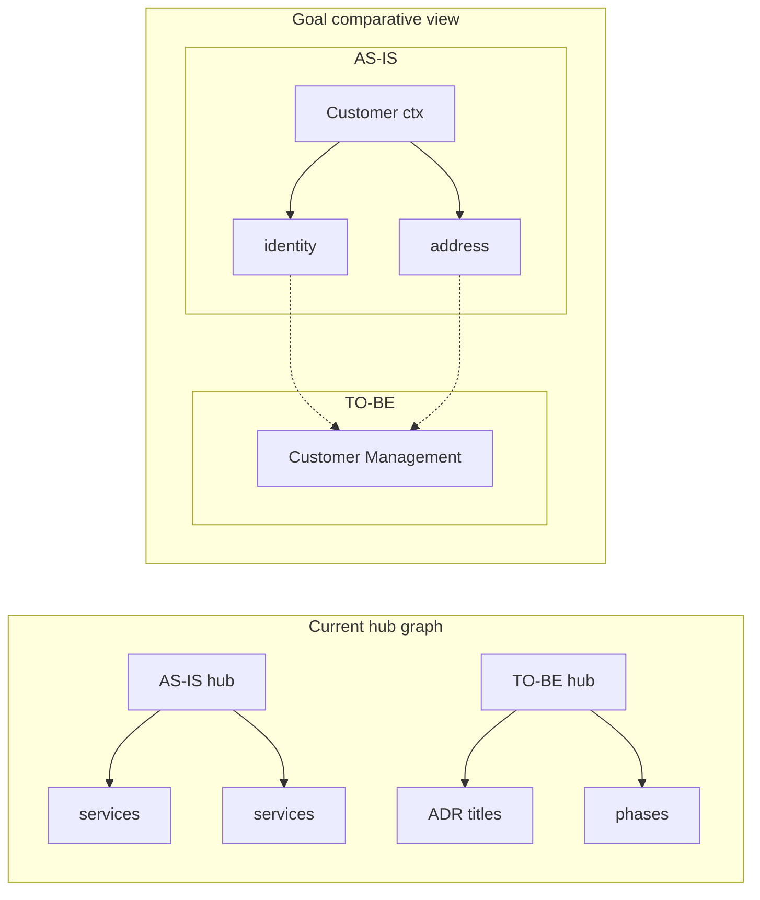

# AS-IS → TO-BE architecture — comparative diagram options

## Problem

The current [`build_plotly_as_is_to_be`](platform/migrate_framework/ui/visualizations.py) uses **spring layout** on a star graph: one **AS-IS hub** fans out to services, one **TO-BE hub** fans out to ADR titles and phase names. There are **no edges from specific services to their target contexts**, so the chart does not answer:

- Which granular services merge into which bounded context?
- How many services become how many deployables?
- What moves in which migration phase?

[`build_mermaid_as_is_to_be`](platform/migrate_framework/ui/visualizations.py) groups AS-IS by context but only links `asis_sg --> tobe_sg` as a single arrow. [`governance_panel.render_as_is_to_be`](platform/migrate_framework/ui/governance_panel.py) is a **text table** — accurate but not visual.



## Diagram options evaluated

| Option | Comparative strength | Fits POC data | UX notes |
|--------|---------------------|---------------|----------|
| **A. Side-by-side boxes + migration arrows** | Excellent — literal before/after columns | ADR `affected_services` + `target_context`, ingest `bounded_contexts`, plan `phases` | Fixed layout (like context tree); theme via Plotly; hover ADR summary |
| **B. Sankey (service → context flow)** | Excellent for consolidation story | Same edge list as A | Width = # services; weak for intra-AS-IS dependencies |
| **C. Enhanced Mermaid LR subgraphs** | Good if per-service cross-links added | Extend existing `build_mermaid_as_is_to_be` | Static; theme/iframe issues we already hit with graphs |
| **D. Capability matrix heatmap** | Good for engineers | [`capability_matrix`](platform/migrate_framework/vv/capability_matrix.py) exists | Table, not architecture picture; keep in Governance |
| **E. Phased swimlane** | Good for *when* not *what* | `plan_phases` + services per phase | Complement to A/B; crowded with 16+ services |
| **F. Metric-only bars (counts per context)** | Summary only | Easy | Pair with A as summary strip (same pattern as context map) |

## Recommended approach

**Primary (implement): Option A — side-by-side migration map**

- **Left column (AS-IS):** ingest `bounded_contexts` as compound groups; leaf nodes = services (blue/teal).
- **Right column (TO-BE):** unique `target_context` from ADRs + plan phase names as consolidated nodes (green); optional “Cross-cutting” node for DB-per-context ADR.
- **Cross-links:** dashed/colored edges from each `affected_service` → `target_context` (from ADRs); phase edges styled differently (e.g. dotted, phase color).
- **Summary strip above** (Option F): `N services → M target contexts`, consolidation ratio, mandatory ADR count, phases count.

**Secondary (small UX win): Option B — Sankey toggle**

- Checkbox or radio: **Side-by-side** (default) | **Flow (Sankey)**.
- Same `migration_edges` data; Sankey for stakeholders who prefer flow width over boxes.

**Keep separate (do not replace)**

- Service **dependency** graph (Cytoscape) — runtime AS-IS coupling, not migration mapping.
- Governance **capability matrix** table — endpoint-level traceability.
- L2 Pipeline/Governance tables.

## Data layer (deterministic, no new LLM)

New helper e.g. `build_migration_edges(bounded_contexts, adrs, plan_phases)`:

```python
# Pseudocode
for adr in adrs:
    target = adr["target_context"] or adr["title"]
    for svc in adr.get("affected_services", []):
        edges.append({"source": svc, "target": target, "kind": "adr", "adr_id": adr["id"]})
for phase in plan_phases:
    for svc in phase.get("services", []):
        edges.append({"source": svc, "target": phase["name"], "kind": "phase"})
# Unmapped services: target = "Unmapped" (grey) for honesty
```

Sources already wired in Landscape/Dashboard: `contexts`, `project.metadata["adrs"]`, `migration_plan.phases`.

## Files to change

| File | Change |
|------|--------|
| New: [`transition_map.py`](platform/migrate_framework/ui/transition_map.py) | `build_migration_edges`, `render_transition_summary`, `render_as_is_to_be_map` |
| [`visualizations.py`](platform/migrate_framework/ui/visualizations.py) | `build_plotly_side_by_side_transition`, `build_plotly_migration_sankey`; deprecate or refactor `build_plotly_as_is_to_be` |
| [`dashboard.py`](platform/migrate_framework/ui/dashboard.py) | Call `render_as_is_to_be_map` |
| [`landscape_overview.py`](platform/migrate_framework/ui/landscape_overview.py) | Same in “AS-IS → TO-BE transition map” expander |
| [`guided_review.py`](platform/migrate_framework/ui/guided_review.py) | Same for `as_is_to_be` visual step |
| [`governance_panel.py`](platform/migrate_framework/ui/governance_panel.py) | Caption + link to Landscape viz; keep dataframe for L2 detail |
| New: [`tests/test_transition_map.py`](platform/tests/test_transition_map.py) | Edge builder + layout smoke tests |

## Success criteria

- User can answer **“5 customer services → 1 Customer Management context”** without opening ADRs.
- AS-IS and TO-BE appear **side-by-side** (not two hubs in one force graph).
- Cross-links visible for every mapped service; unmapped services obvious.
- Works in Dashboard, Landscape, Guided Review (recommend/plan stages).
- Plotly theme follows Streamlit light/dark.

## Verification

```powershell
cd platform
.\.venv\Scripts\python.exe -m pytest tests/test_transition_map.py tests/test_visualizations.py -q
.\.venv\Scripts\streamlit run migrate_framework\ui\app.py
```

Open **Landscape → AS-IS → TO-BE transition map**: summary metrics, side-by-side diagram, optional Sankey toggle.
