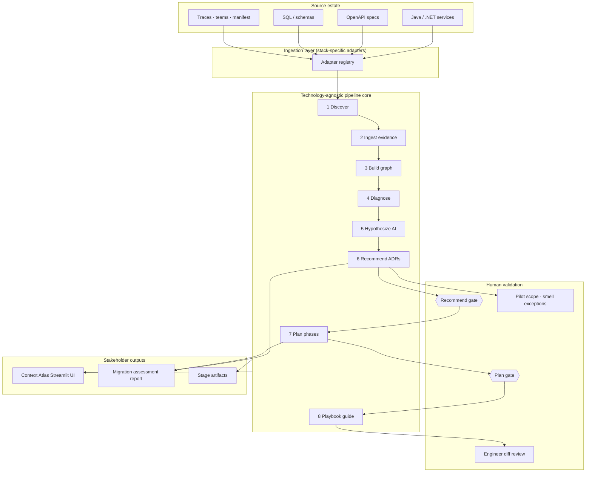
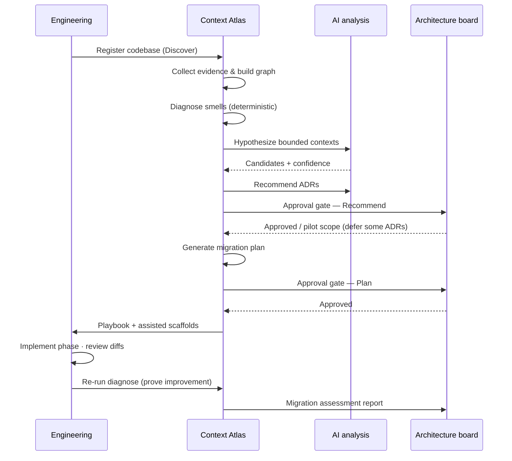
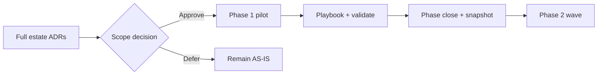
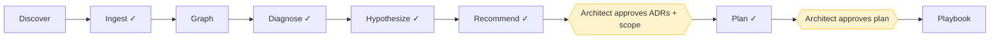
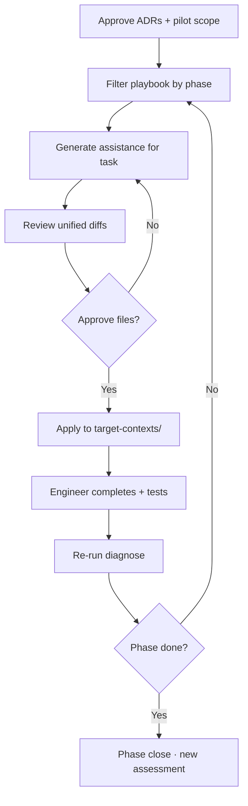
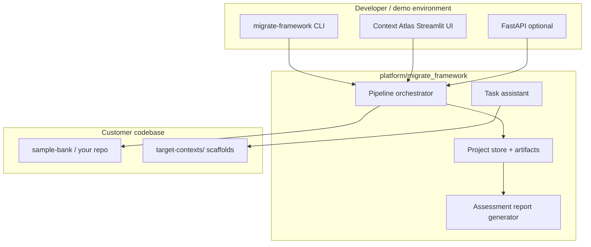

# Context Atlas
## Evidence-led estate assessment

**EuroSA Bank POC**  
Discover → Evidence → Diagnose → Hypothesize → Recommend → **Human gates** → Plan → Guide

---

# The challenge

EuroSA Bank’s estate was split into **many fine-grained microservices** along technical lines—not business capabilities.

| Symptom | Business impact |
|---------|-----------------|
| 5 customer services sharing one database | Data coupling, change risk, unclear ownership |
| 6+ service sync chains for one payment | Latency, failure amplification, hard cutovers |
| Rules split across services | Slow delivery, inconsistent behaviour |
| “Customer” in name ≠ same domain | Wrong consolidation decisions if done blindly |

**Goal:** Move to **domain-aligned bounded contexts** without reckless auto-merging.

---

# What we built

A **reusable migration framework** (**Context Atlas**) that:

1. **Collects evidence** from code, APIs, databases, traces, and teams
2. **Diagnoses** architectural smells deterministically
3. **Proposes** bounded contexts with confidence scores (AI-assisted)
4. **Requires human approval** before plan and execution
5. **Guides engineers** through phased migration with reviewable diffs

Demonstrated on a **16-service Java/Spring Boot** sample bank (EuroSA POC).

---

# Evolution: v1 → current

| Area | v1 (initial POC) | Current (Context Atlas) |
|------|------------------|-------------------------|
| **UI** | Basic dashboard, artifact tables | **L0 / L1 / L2** progressive disclosure + role-based navigation |
| **Navigation** | Flat views | Dashboard · Guided Review · Landscape · Pipeline · Phases · Governance · **Assessment** · Playbook |
| **Report** | Download-only (sidebar) | **In-app migration assessment** + download from report page |
| **AS-IS → TO-BE** | Sankey flow only | **Architecture comparison** (default) + consolidation flow (scope) |
| **Program model** | Full-estate plan | **Pilot scope** — approve N of M ADRs; defer rest to later waves |
| **Graph metrics** | “246 nodes” (confusing) | **16 deployable services** vs **246 knowledge-graph nodes** (explained) |
| **Governance** | Gates + ADRs | + smell exceptions · phase snapshots · phase close · CLI/UI parity |

> **Thesis unchanged:** Humans approve architecture and plan; the tool never auto-merges services.

---

# What the tool is — and is not

| ✅ The tool **is** | ❌ The tool is **not** |
|-------------------|------------------------|
| Evidence-backed architecture assessment | An auto-merge / “fix my estate” button |
| AI-assisted hypotheses & ADRs | A replacement for architects |
| Phased migration plan + playbook | Unattended production cutover |
| Dashboard, **in-app assessment**, assisted scaffolds | A one-time script for one repo only |
| Human gates & audit trail | Silent refactoring without review |

---

# Logical architecture

---

# End-to-end flow (one picture)

---

# The 8-stage pipeline

| # | Stage | Who runs it | Primary output |
|---|--------|-------------|----------------|
| 1 | **Discover** | Framework | Service inventory, tech stack |
| 2 | **Ingest** | Adapters | Normalized evidence bundle |
| 3 | **Graph** | Framework | Architecture knowledge graph |
| 4 | **Diagnose** | Metrics engine | Health report, smells |
| 5 | **Hypothesize** | AI (+ evidence) | 2–4 bounded context candidates |
| 6 | **Recommend** | AI (+ evidence) | ADRs, target architecture |
| 7 | **Plan** | Framework + AI | Phased migration plan |
| 8 | **Guide (Playbook)** | Engineers + framework | Task checklist, assisted diffs |

Stages **1–4** are fully **deterministic** (repeatable, auditable).  
Stages **5–7** are **evidence-backed**; **6–7** require **human approval**.

---

# Stage 1 — Discover

**What it does**  
Scans the repository landscape: service count, languages, frameworks, target contexts from manifest.

**Benefit to stakeholders**  
- Single **source of truth** for “what we have”  
- Baseline before any AI or opinion enters the process  
- Fast onboarding of **new codebases** (not just EuroSA)

**Output:** Service inventory, stack profile, landscape linkage

---

# Stage 2 — Ingest (Collect evidence)

**What it does**  
Adapters extract facts from OpenAPI, Spring Boot/Maven, SQL migrations, Docker Compose, synthetic traces, team ownership.

**Benefit to stakeholders**  
- Decisions anchored in **artifacts**, not slides  
- **296+ evidence items** in EuroSA POC — auditable trail  
- Only this layer changes per technology (.NET stubs ready for Phase 2)

**Output:** Evidence bundle (types, sources, relations)

---

# Stage 3 — Graph (Model)

**What it does**  
Builds an **architecture knowledge graph**: services, APIs, databases, tables, teams, bounded contexts, smells — nodes and edges.

**Important distinction**

| Metric | EuroSA POC example | Meaning |
|--------|-------------------|---------|
| **Deployable services** | **16** | Microservices in the interactive diagram |
| **Knowledge graph nodes** | **246** | All evidence entities (APIs, DBs, tables, …) |
| **Knowledge graph edges** | **282** | All relationships (calls, stores_in, exposes, …) |

The **service diagram** shows deployables only; the knowledge graph powers diagnosis and audit.

---

# Stage 4 — Diagnose

**What it does**  
Deterministic smell detection: shared databases, sync REST chains, granular decomposition, coupling metrics.

**Benefit to stakeholders**  
- **Objective health score** for the current estate  
- Prioritizes **where migration pain is highest**  
- Same input → same output (regulatory-friendly repeatability)  
- **Smell governance:** accept business-critical smells as-is; exclude from planning

**Output:** Smell catalog, sync chains, recommendations preview

---

# Stage 5 — Hypothesize (AI)

**What it does**  
Proposes **2–4 candidate bounded contexts** with confidence, rationale, and affected services — grounded in diagnosis + landscape.

**Benefit to stakeholders**  
- Accelerates **weeks of workshop time** into evidence-backed options  
- Confidence scores support **risk-aware** decisions  
- Works in **mock mode** without API key (POC/demo safe)

**Output:** Migration hypotheses (e.g. Customer Management @ 85%)

---

# Stage 6 — Recommend (AI + gate)

**What it does**  
Produces **Architecture Decision Records (ADRs)**: consolidate X services into Y context, async for payment chains, consequences.

**Benefit to stakeholders**  
- Standard **governance artifact** architecture boards already use  
- Explicit **consequences** and affected services  
- **Approval gate** — nothing proceeds without sign-off  
- **Pilot scope:** approve subset of ADRs; defer others to later waves

**Output:** ADRs (YAML) · **Required human approval**

---

# Stage 7 — Plan (AI + gate)

**What it does**  
Sequences migration into **phases** with duration, dependencies, risk, tasks, and linked ADRs.

**Benefit to stakeholders**  
- **Delivery roadmap** for program management (e.g. 4 phases, ~20 weeks POC plan)  
- Dependencies prevent unsafe ordering (Customer before Payments)  
- **Approval gate** before execution spend  
- Deferred ADRs → phases marked **deferred** in plan

**Output:** Migration plan JSON · **Required human approval**

---

# Stage 8 — Guide (Playbook)

**What it does**  
Generates **manual tasks** by team (platform, data, feature, QA) plus **assisted execution** with **diff review**.

**Benefit to stakeholders**  
- Clear **accountability** (who does what)  
- No silent auto-merge — engineers **approve each file** before apply  
- Re-run diagnose after each phase to **prove improvement**

**Output:** Playbook tasks, scaffolds under `target-contexts/`, status tracking

---

# Visual pipeline UX (L0 / L1 / L2)

| Layer | What the user sees | Example |
|-------|-------------------|---------|
| **L0** | Charts & interactive visuals | Service graph, context map, smell overlay, sync chains |
| **L1** | Classified summary cards | Graph metrics, smell severity, gate status, readiness |
| **L2** | Full tables & raw artifacts | Evidence tables, ADR detail, pipeline outputs |

**Guided Review** walks architects stage-by-stage with L0 + L1, then L2 on demand.

**Role-based views:** architect → Guided Review · engineer → Pipeline · program → Phases

---

# Program governance (pilot & phases)

| Capability | Purpose |
|------------|---------|
| **Scoped pilot** | Approve 2 of N TO-BE contexts; defer others |
| **Smell exceptions** | Accept smells; visible in diagnose, excluded from plan |
| **Phase snapshots** | Eight-stage metrics per wave for readiness scoring |
| **Phase close** | Formal sign-off before next cutover |

**CLI & UI parity:** batch scope wizard, smell decisions, phase context assignment

---

# AS-IS → TO-BE storytelling

Two complementary views — not one misleading diagram:

| View | Purpose | Audience |
|------|---------|------------|
| **Architecture comparison** | AS-IS vs TO-BE bounded contexts, deployable counts, ADR links | Architects, ARB |
| **Consolidation flow** (Sankey) | Which services roll into which target | Program / pilot scope |

**Honest TO-BE counts:** Customer Management **3 → 1** deployable (not “3 → 3”).

Sankey is a **scope mapping** tool — not a runtime architecture diagram.

---

# Human approval gates

| Gate | Required? | Purpose |
|------|-----------|---------|
| Ingest, Diagnose, Hypothesize, Recommend, Plan | **Yes** | Block progress until prior stage signed off |
| Discover, Graph, Playbook | Optional | Informational / execution guidance |

---

# Stakeholder deliverables

| Deliverable | Audience | v1 | Current |
|-------------|----------|-----|---------|
| **Context Atlas dashboard** | Architects, engineers | Basic pipeline UI | L0/L1/L2 visual pipeline + governance |
| **Migration assessment report** | Executives, ARB | Download only | **In-app view** + Markdown/HTML download |
| **ADRs** | Architecture board | Formal decisions | + pilot scope decisions |
| **Migration plan** | Program / delivery | Phasing, dependencies | + deferred phases for out-of-scope ADRs |
| **Playbook** | Squads | Sprint-ready tasks | Assisted scaffolds + diff review |

**Assessment:** sidebar **View migration assessment** button or **Assessment** tab  
**CLI:** `python -m migrate_framework.cli report --project-id <id>`

---

# EuroSA POC — results at a glance

| Metric | Before (granular) | Target (bounded) |
|--------|-------------------|------------------|
| Deployable services | **16** | **4** core contexts (+ supporting) |
| Knowledge graph | **246 nodes / 282 edges** | Grows with evidence; services stay ~16 |
| Customer domain | 5 services, 1 shared DB | **Customer Management** (3 → 1) |
| Payments | 4+ sync hops | **Payments** + async integration ADR |
| Evidence items | 296+ collected | Re-run after each phase |
| Architecture smells | Shared DB, sync chains, granularity | Tracked + governable per smell |

**Context map (target):**  
Customer Management → Account Management → Payments → Risk & Compliance

---

# Business benefits

### Risk reduction
- Evidence before consolidation — fewer wrong merges
- Human gates at **architecture** and **plan** — not just code review
- Diff-reviewed scaffolds — no blind automation
- **Pilot scope** — no forced big-bang on full estate

### Speed & clarity
- Weeks of discovery → **hours** for initial assessment
- **In-app assessment** for aligned conversations across IT and business
- Phased plan reduces big-bang cutover risk

### Reuse & scale
- **Technology-agnostic core** — Java POC today, .NET tomorrow
- Same pipeline on **any** microservice estate
- Cursor skills/rules embed methodology in daily engineering

### Governance
- ADRs, artifacts, approval timestamps — **audit trail**
- Deterministic stages 1–4 — reproducible for compliance reviews
- Phase snapshots — prove improvement wave over wave

---

# Assisted migration (after approval)

Supported scaffolds: bounded-context skeleton, ACL stubs, SQL drafts, contract tests, aggregate docs, unified API draft.

---

# Logical deployment view

---

# Technology support

| Stack | Status | Adapters |
|-------|--------|----------|
| **Java / Spring Boot** | ✅ POC complete | Maven, Spring Boot, OpenAPI, SQL, Docker |
| **Shared** | ✅ Complete | Metadata, traces, landscape manifest |
| **.NET / ASP.NET Core** | 🔜 Stubs registered | EF Core, csproj, ASP.NET — implement next |

**Key principle:** Only **ingestion adapters** change per stack; the **8-stage pipeline** stays the same.

---

# Roadmap & honest gaps

| Area | Today | Next |
|------|-------|------|
| AI hypotheses | GPT-4o or mock | Fine-tune on bank domain patterns |
| .NET estates | Adapter stubs | Full parity with Java |
| Playbook | Assisted scaffolds + diff review | Deeper Cursor task integration |
| CI/CD | Manual re-run diagnose | Pipeline in Azure DevOps / GitHub Actions |
| Prod cutover | Playbook tasks (manual) | Runbook templates + observability hooks |
| Task status | Dashboard tracking | Jira/ADO sync |

Transparency builds trust: we **show gaps** rather than over-promise automation.

---

# Live demo flow (~15 min)

1. **Initialize** project on `sample-bank`
2. **Dashboard** — context map, service graph (**16** deployables)
3. **Guided Review** — discover → diagnose with L1 summaries
4. **Graph** — explain **16 services vs 246 knowledge-graph nodes**
5. **Governance** — pilot scope (approve 2 of N ADRs) + recommend gate
6. **Phases** — smell decisions, phase context assignment
7. **Assessment** — in-app report + download HTML
8. **Playbook** — assisted Phase 1 scaffold + diff review
9. **Message:** “We decide; the tool evidences and guides.”

Commands: see `docs/poc-demo-script.md`

---

# Recommended next steps

### For architecture board
1. Review **migration assessment report** and **ADRs** in Context Atlas
2. Approve recommend + plan gates (or request modifications)
3. Agree **Phase 1 pilot scope** (e.g. Customer Management only; defer Payments)

### For engineering
1. Execute **Phase 1 playbook** with assisted diffs
2. Strangler routing + contract tests before cutover
3. **Re-run diagnose** — attach before/after assessment to Phase 2 gate

### For program management
1. Map phases to **squads and timeline**
2. Track playbook tasks by owner; use **phase close** checkpoints
3. Schedule assessment refresh after each wave

---

# Summary

| Question | Answer |
|----------|--------|
| **What problem?** | Over-granular microservices, coupling, shared data |
| **What approach?** | Evidence → AI hypotheses → human validation → guided migration |
| **What do we get?** | Health diagnosis, ADRs, pilot scope, phased plan, playbook, **in-app assessment** |
| **What don’t we get?** | Unattended auto-merge |
| **Why trust it?** | Deterministic core, evidence artifacts, approval gates, diff review, phase snapshots |

---

# Thank you

**Product:** Context Atlas —Architecture Intelligence + Transformation Intelligence + Guided Modernization
**Repository:** AI_Driven_Project_Migration  
**Docs:** `docs/framework-methodology.md` · `docs/poc-demo-script.md`  
**Dashboard:** `streamlit run migrate_framework/ui/app.py`

Questions?
