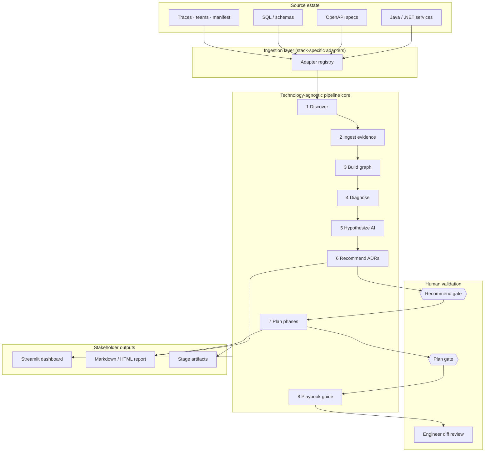
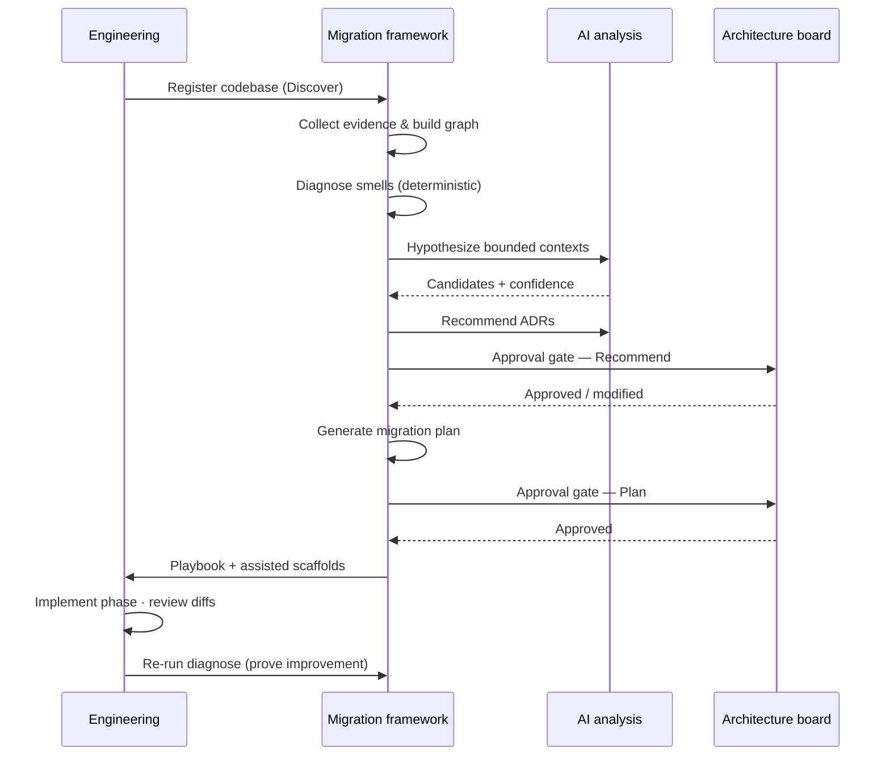
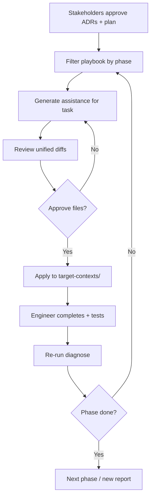
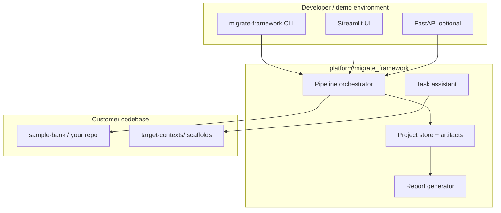

# AI-Assisted Migration Framework
## From granular microservices to bounded contexts

**EuroSA Bank POC**  
Evidence → Hypothesis → Recommendation → Human validation → Migration

---

# The challenge

EuroSA Bank’s estate was split into **many fine-grained microservices** along technical lines—not business capabilities.

| Symptom | Business impact |
|---------|-----------------|
| 5 customer services sharing one database | Data coupling, change risk, unclear ownership |
| 6+ service sync chains for one payment | Latency, failure amplification, hard cutovers |
| Rules split across services | Slow delivery, inconsistent behaviour |
| “Customer” in name ≠ same domain | Wrong consolidation decisions if done blindly |

**Goal:** Move to **domain-aligned bounded contexts** without reckless auto-merging.

---

# What we built

A **reusable migration framework** that:

1. **Collects evidence** from code, APIs, databases, traces, and teams  
2. **Diagnoses** architectural smells deterministically  
3. **Proposes** bounded contexts with confidence scores (AI-assisted)  
4. **Requires human approval** before plan and execution  
5. **Guides engineers** through phased migration with reviewable diffs  

Demonstrated on a **16-service Java/Spring Boot** sample bank (EuroSA POC).

---

# What the tool is — and is not

| ✅ The tool **is** | ❌ The tool is **not** |
|-------------------|------------------------|
| Evidence-backed architecture assessment | An auto-merge / “fix my estate” button |
| AI-assisted hypotheses & ADRs | A replacement for architects |
| Phased migration plan + playbook | Unattended production cutover |
| Dashboard, reports, assisted scaffolds | A one-time script for one repo only |
| Human gates & audit trail | Silent refactoring without review |

> **Thesis:** Technology-oriented decomposition → business-capability-oriented decomposition — **with humans in control.**

---

# Logical architecture

---

# End-to-end flow (one picture)

---

# The 8-stage pipeline

| # | Stage | Who runs it | Primary output |
|---|--------|-------------|----------------|
| 1 | **Discover** | Framework | Service inventory, tech stack |
| 2 | **Ingest** | Adapters | Normalized evidence bundle |
| 3 | **Graph** | Framework | Architecture knowledge graph |
| 4 | **Diagnose** | Metrics engine | Health report, smells |
| 5 | **Hypothesize** | AI (+ evidence) | 2–4 bounded context candidates |
| 6 | **Recommend** | AI (+ evidence) | ADRs, target architecture |
| 7 | **Plan** | Framework + AI | Phased migration plan |
| 8 | **Guide (Playbook)** | Engineers + framework | Task checklist, assisted diffs |

Stages **1–4** are fully **deterministic** (repeatable, auditable).  
Stages **5–7** are **evidence-backed**; **6–7** require **human approval**.

---

# Stage 1 — Discover

**What it does**  
Scans the repository landscape: service count, languages, frameworks, target contexts from manifest.

**Benefit to stakeholders**  
- Single **source of truth** for “what we have”  
- Baseline before any AI or opinion enters the process  
- Fast onboarding of **new codebases** (not just EuroSA)

**Output:** Service inventory, stack profile, landscape linkage

---

# Stage 2 — Ingest (Collect evidence)

**What it does**  
Adapters extract facts from OpenAPI, Spring Boot/Maven, SQL migrations, Docker Compose, synthetic traces, team ownership.

**Benefit to stakeholders**  
- Decisions anchored in **artifacts**, not slides  
- **296+ evidence items** in EuroSA POC — auditable trail  
- Only this layer changes per technology (.NET stubs ready for Phase 2)

**Output:** Evidence bundle (types, sources, relations)

---

# Stage 3 — Graph (Model)

**What it does**  
Builds an **architecture knowledge graph**: services, dependencies, databases, teams, smells as nodes and edges.

**Benefit to stakeholders**  
- Visualizes **hidden coupling** (who calls whom, shared DBs)  
- Feeds deterministic metrics — not a black-box AI guess  
- Supports “show me the evidence” conversations

**Output:** Service graph, density, dependency edges

---

# Stage 4 — Diagnose

**What it does**  
Deterministic smell detection: shared databases, sync REST chains, granular decomposition, coupling metrics.

**Benefit to stakeholders**  
- **Objective health score** for the current estate  
- Prioritizes **where migration pain is highest**  
- Same input → same output (regulatory-friendly repeatability)

**Output:** Smell catalog, sync chains, recommendations preview

---

# Stage 5 — Hypothesize (AI)

**What it does**  
Proposes **2–4 candidate bounded contexts** with confidence, rationale, and affected services — grounded in diagnosis + landscape.

**Benefit to stakeholders**  
- Accelerates **weeks of workshop time** into evidence-backed options  
- Confidence scores support **risk-aware** decisions  
- Works in **mock mode** without API key (POC/demo safe)

**Output:** Migration hypotheses (e.g. Customer Management @ 85%)

---

# Stage 6 — Recommend (AI + gate)

**What it does**  
Produces **Architecture Decision Records (ADRs)**: consolidate X services into Y context, async for payment chains, consequences.

**Benefit to stakeholders**  
- Standard **governance artifact** architecture boards already use  
- Explicit **consequences** and affected services  
- **Approval gate** — nothing proceeds without sign-off

**Output:** ADRs (YAML) · **Required human approval**

---

# Stage 7 — Plan (AI + gate)

**What it does**  
Sequences migration into **phases** with duration, dependencies, risk, tasks, and linked ADRs.

**Benefit to stakeholders**  
- **Delivery roadmap** for program management (e.g. 4 phases, ~20 weeks POC plan)  
- Dependencies prevent unsafe ordering (Customer before Payments)  
- **Approval gate** before execution spend

**Output:** Migration plan JSON · **Required human approval**

---

# Stage 8 — Guide (Playbook)

**What it does**  
Generates **manual tasks** by team (platform, data, feature, QA) plus **assisted execution** with **diff review**.

**Benefit to stakeholders**  
- Clear **accountability** (who does what)  
- No silent auto-merge — engineers **approve each file** before apply  
- Re-run diagnose after each phase to **prove improvement**

**Output:** Playbook tasks, scaffolds under `target-contexts/`, status tracking

---

# Human approval gates

| Gate | Required? | Purpose |
|------|-----------|---------|
| Ingest, Diagnose, Hypothesize, Recommend, Plan | **Yes** | Block progress until prior stage signed off |
| Discover, Graph, Playbook | Optional | Informational / execution guidance |

---

# Stakeholder deliverables

| Deliverable | Audience | Use |
|-------------|----------|-----|
| **Streamlit dashboard** | Architects, engineers | Run pipeline, approve gates, explore artifacts |
| **Markdown / HTML report** | Executives, ARB | Shareable assessment + plan |
| **ADRs** | Architecture board | Formal decisions |
| **Migration plan** | Program / delivery | Phasing, budget, dependencies |
| **Playbook** | Squads | Sprint-ready execution tasks |

Download report from dashboard or CLI:  
`python -m migrate_framework.cli report --project-id <id>`

---

# EuroSA POC — results at a glance

| Metric | Before (granular) | Target (bounded) |
|--------|-------------------|------------------|
| Deployable services | **16** | **4** core contexts (+ supporting) |
| Customer domain | 5 services, 1 shared DB | **Customer Management** |
| Payments | 4+ sync hops | **Payments** + async integration ADR |
| Evidence items | 296+ collected | Re-run after each phase |
| Architecture smells | Shared DB, sync chains, granularity | Tracked per diagnose run |

**Context map (target):**  
Customer Management → Account Management → Payments → Risk & Compliance

---

# Business benefits

### Risk reduction
- Evidence before consolidation — fewer wrong merges  
- Human gates at **architecture** and **plan** — not just code review  
- Diff-reviewed scaffolds — no blind automation  

### Speed & clarity
- Weeks of discovery → **hours** for initial assessment  
- Single report for **aligned conversations** across IT and business  
- Phased plan reduces big-bang cutover risk  

### Reuse & scale
- **Technology-agnostic core** — Java POC today, .NET tomorrow  
- Same pipeline on **any** microservice estate  
- Cursor skills/rules embed methodology in daily engineering  

### Governance
- ADRs, artifacts, approval timestamps — **audit trail**  
- Deterministic stages 1–4 — reproducible for compliance reviews  

---

# Assisted migration (after approval)

Supported scaffolds: bounded-context skeleton, ACL stubs, SQL drafts, contract tests, aggregate docs, unified API draft.

---

# Logical deployment view

---

# Technology support

| Stack | Status | Adapters |
|-------|--------|----------|
| **Java / Spring Boot** | ✅ POC complete | Maven, Spring Boot, OpenAPI, SQL, Docker |
| **Shared** | ✅ Complete | Metadata, traces, landscape manifest |
| **.NET / ASP.NET Core** | 🔜 Stubs registered | EF Core, csproj, ASP.NET — implement next |

**Key principle:** Only **ingestion adapters** change per stack; the **8-stage pipeline** stays the same.

---

# Roadmap & honest gaps

| Area | Today | Next |
|------|-------|------|
| AI hypotheses | GPT-4o or mock | Fine-tune on bank domain patterns |
| .NET estates | Adapter stubs | Full parity with Java |
| Playbook | Assisted scaffolds + diff review | Deeper Cursor task integration |
| CI/CD | Manual re-run diagnose | Pipeline in Azure DevOps / GitHub Actions |
| Prod cutover | Playbook tasks (manual) | Runbook templates + observability hooks |
| Task status | Dashboard tracking | Jira/ADO sync |

Transparency builds trust: we **show gaps** rather than over-promise automation.

---

# Live demo flow (~15 min)

1. **Initialize** project on `sample-bank`  
2. **Run** discover → diagnose — show 16 services, smells  
3. **Run** hypothesize → recommend — show 4 bounded contexts  
4. **Dashboard** — approve recommend & plan gates  
5. **Download** stakeholder report (HTML)  
6. **Playbook** — assisted Phase 1 scaffold + diff review  
7. **Message:** “We decide; the tool evidences and guides.”  

Commands: see `docs/poc-demo-script.md`

---

# Recommended next steps

### For architecture board
1. Review downloadable **report** and **ADRs**  
2. Approve recommend + plan gates (or request modifications)  
3. Agree Phase 1 scope (e.g. Customer Management only)  

### For engineering
1. Execute **Phase 1 playbook** with assisted diffs  
2. Strangler routing + contract tests before cutover  
3. **Re-run diagnose** — attach before/after report to Phase 2 gate  

### For program management
1. Map phases to **squads and timeline**  
2. Track playbook tasks by owner  
3. Schedule checkpoint after each phase  

---

# Summary

| Question | Answer |
|----------|--------|
| **What problem?** | Over-granular microservices, coupling, shared data |
| **What approach?** | Evidence → AI hypotheses → human validation → guided migration |
| **What do we get?** | Health diagnosis, ADRs, phased plan, playbook, reports |
| **What don’t we get?** | Unattended auto-merge |
| **Why trust it?** | Deterministic core, evidence artifacts, approval gates, diff review |

---

# Thank you

**Repository:** AI_Driven_Project_Migration  
**Docs:** `docs/framework-methodology.md` · `docs/poc-demo-script.md`  
**Dashboard:** `streamlit run migrate_framework/ui/app.py`

Questions?
